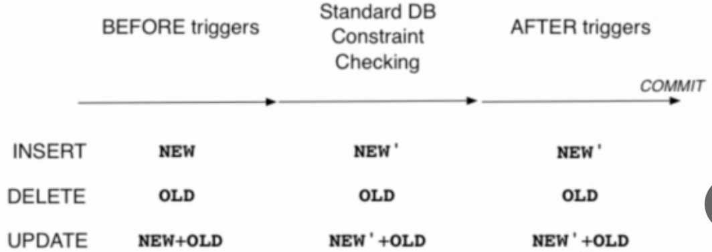

### BEFORE vs AFTER Triggers
**BEFORE**
- fire before standard DB constraint checking
- typically used to
  - modify the tuple that is about to be inserted
  - check cross-table constraints
- for `INSERT` and `UPDATE`, return value is tuple to be added (`NEW'`)
- for `DELETE` returned value has no direct effect, but it has to be nonnull to allow the trigger action to proceed 

**AFTER**
- fire after standard DB constraint checking
- typically used
  - to modify other tables to ensure consistency
- return value is always ignored

```sql
insert Employee('anna', '2000-01-01') <- NEW

Employee('anna', '2000-01-01', 200) <- NEW'

delete from Employees where name='anna'
('anna', '2000-01-01', 'Sales') <- OLD

update Managers set name= 'bob' where department='Sales'
('Sales', 'anna') <- OLD
('Sales', 'bob') <- NEW
```

### Example

1. We have 2 tables - `Employees` and `Departments`
2. Insert `Employee('anna', '2000-01-01', 'Sales')` <- `NEW`
3. `BEFORE` trigger uses employee name to generate an ID
4. Actually insert `Employee('anna bob', '2000-01-01', 'abob', 'Sales')` <- `NEW'`
5. Standard DB constraint runs (eg. check primary/foreign keys)
6. `AFTER` trigger increments the employee count in the `Departments` table
7. Change is commited
    - if there are any failures along the way, the whole thing is aborted

### Trigger Definition

```sql
-- create trigger function to defines what happens when it is called
-- what to do
create function trigger_function()
    return trigger
as $$
begin
    -- trigger logic
end;
$$
language plpgsql

-- define the database event that would call the trigger
-- when to do it
create trigger trigger_name
[before | after] [insert | delete | update]
on table_name
for each [row | statement]
execute procedure trigger_function();

```