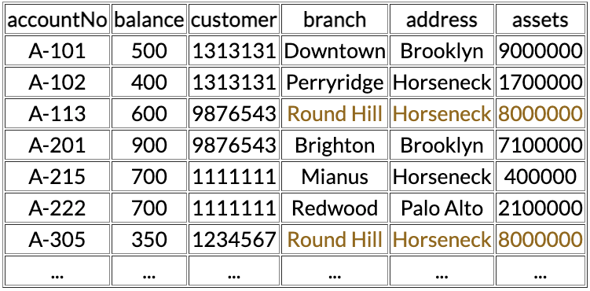

# Recap

## Redundancy is Bad

what if we want to

- change balance of A-113
- add new account
- delete account
- update branch address

## Functional Dependency

X → Y

can be read as:

- Y functionally depends on X
- X determines Y
- if we know X then we know Y

Rules

reflexivity:             X → X

augmentation:            X → Y         ⇒ XZ → YZ

transitivity:            X → Y, Y → Z  ⇒ X → Z

additivity:              X → Y, X → Z  ⇒ X → YZ

projectivity:            X → YZ        ⇒ X → Y, X → Z

pseudotransitivity:      X → Y, YZ → W ⇒ XZ → W

What is a trivial functional dependency X → Y?

Y is a subset of X

## Closure

X+       largest set of attributes that can be derived from X using F

where

X         set of attributes

F         set of functional dependencies

## Super Key

set of attributes that uniquely identifies a tuple in a table

any set X, such that X+ = R

## Candidate Key

a.k.a primary key

minimal superkey

any set X, such that X+ = R and there is no Y subset of X such that Y+ = R

## Normal Forms

- measure of redundancy
- range from 1NF to 5NF
    - 1NF most redundancy
    - 5NF least redundancy
- BCNF and 3NF are somewhere in the middle
    - BCNF is kinda like 3.5NF (less redundancy than 3NF)

## Boyce-Codd Normal Form (BCNF)

for all functional dependencies X → Y

either

- X → Y is trivial

or

- X is a super key

## Third Normal Form (3NF)

for all functional dependencies X → Y

either

- X → Y is trivial

or

- X is a super key

or

- Y is single attribute of a candidate key

## BCNF vs 3NF

|  | BCNF | 3NF |
| --- | --- | --- |
| lossless join | ✅ | ✅ |
| preserves all fds | ❌ | ✅ |

## **************************Minimal Cover**************************

1. Split FDs so that there is only one attribute on the RHS
2. Use the rules above to remove redundant FDs